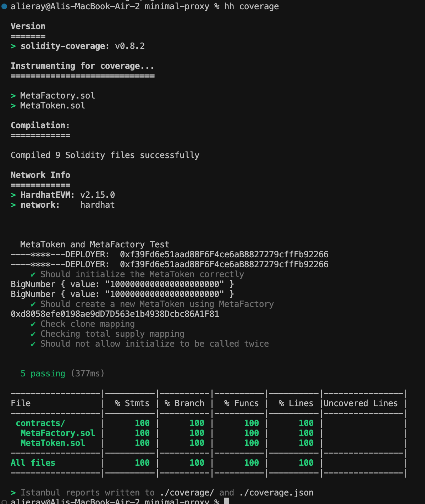

# Minimal-Proxy

You can find my progress in this section, I will try to write down my progress in the project as much as I can.

* I'm in a quick research phase as I haven't worked with a proxy contract before.
* This link is helpful https://www.youtube.com/watch?v=9xqoK2nKkM4
* I thought I might find something about this topic on openzeppelin and after some searching, I found the Clones section under the proxy section. I think the sections here match what is requested in the task. I will search different sources and if I decide it is right, I will start implementing it. https://docs.openzeppelin.com/contracts/4.x/api/proxy#minimal_clones
* I need an initializer to give constructor parameters to new versions
* deploy scripts were prepared
* Token contract and factory contract is ready now I will write tests with js
* Tests were successful
* 
* It seems that the task assigned to me is now finished.
What to do next: Typescript version, controls, improvements 